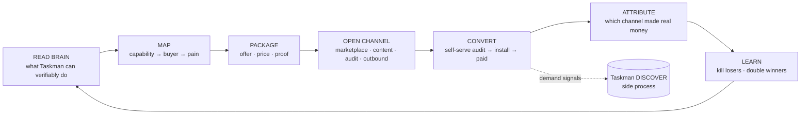

# Sellman

**The sales department for Taskman.**

Taskman is the private engine that touches money streams (detect → intervene → verify → charge).
Sellman is the department that finds the people who pay for it — continuously, with no sales calls.

> Taskman stays private. Customers never get "invited into Taskman".
> Sellman packages what Taskman can *verifiably* do into outcomes people buy,
> finds the buyers, converts them self-serve, and proves the revenue came from it.

---

## The loop

Taskman runs `CONNECT → LISTEN → DETECT → INTERVENE → VERIFY → MEASURE → CHARGE`.
Sellman runs its own loop on top of Taskman's brain:



Two things make this different from a normal marketing stack:

1. **Truth comes from the brain.** Sellman can only sell a capability at the level Taskman has
   verified it. Planned features cannot be sold. Beta features cannot carry numbers. Verified
   features can carry numbers only if Taskman's proof metrics back them. This is enforced in code
   (`src/guard/claims.js`), not in a prompt.
2. **The North Star is Taskman money, not leads.** The only number that matters is verified revenue
   Taskman earned from customers Sellman sourced. Opens, clicks, and "pipeline" are diagnostics.

---

## What's in the repo

| Path | What it is |
|---|---|
| `ROADMAP.md` | Phased plan with money gates — what "successful sales" means at each stage |
| `RESEARCH.md` | Market research (Sept 2026): wedges, competitors, channels, compliance |
| `BRAINSTORM.md` | Ideas, bets, and anti-ideas |
| `docs/architecture.md` | Departments, agents, workers, data model, schedules |
| `docs/brain-contract.md` | The read-only contract Sellman uses to read Taskman |
| `docs/metrics.md` | North Star, funnel metrics, kill criteria |
| `docs/operating-cadence.md` | What runs every 15 min / day / week / month, and what you approve |
| `docs/decisions/` | Architecture decision records |
| `skills/` | Sales & marketing skills (SKILL.md format) the agents load as playbooks |
| `agents/` | Agent specs: role, inputs, outputs, guardrails, approval rules |
| `src/` | Node 20 implementation: brain sync, guards, scoring, scheduler, workers, AI router |
| `migrations/` | Postgres schema |
| `config/` | Channels, compliance rules, ICP seeds, example brain manifest |
| `.github/workflows/` | CI + scheduled worker runs |

---

## Quick start

```bash
cp .env.example .env            # fill DATABASE_URL, AI keys, TASKMAN_BRAIN_URL
npm install
npm run migrate
npm test                        # guards, scoring, cron, brain diff, agent specs
npm run schema:check            # runs the schema + worker SQL against an in-process Postgres

# Bootstrap from the example manifest until Taskman exposes /brain/manifest
TASKMAN_BRAIN_FILE=config/brain.example.json node src/index.js run brain-sync

node src/index.js schedule          # show the cron table
node src/index.js run strategist    # run any worker once
node src/index.js approvals         # list items waiting for your yes/no
node src/index.js approve 12        # approve one
node src/index.js daemon            # run the in-process scheduler
```

---

## Operating principles

1. **Sell outcomes, not access.** Each Taskman capability gets a product face (name, page, listing).
2. **Proof sells, not people.** The free audit is the demo, the pitch, and the qualification call.
3. **Marketplaces before outbound.** Go where the money stream already lives (Stripe, Tally, HubSpot, MCP registries).
4. **Deterministic in code, judgment in models.** Scheduling, scoring, caps, claim checks, kill switches: code. Research, drafting, synthesis: models.
5. **Human approves irreversible things, asynchronously.** Publishing, pricing changes, first send of any campaign. A yes/no queue — never a meeting.
6. **Compliance is a gate, not a guideline.** Suppression, consent rules per jurisdiction, deliverability kill switch. No mailbox rotation to dodge limits.
7. **Every run logs cost.** Sellman must cost less than the revenue it attributes. If it doesn't, it stops itself.
8. **Sellman feeds Taskman.** Demand signals (audit results, early-access signups, lost-deal reasons) flow back to Taskman's DISCOVER side process.
